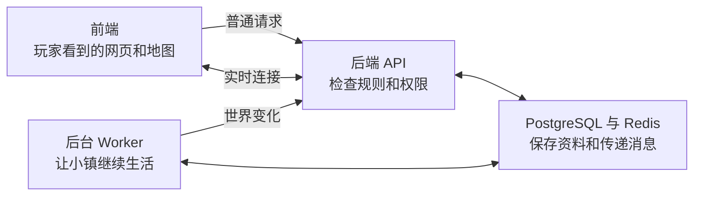

# Simverse World 系统结构

这篇文章写给想看懂代码的人。

它不教生产部署。
它只解释项目的各部分怎样合作。

陌生技术词可以查看[词语表](GLOSSARY.md)。

## 先看四个盒子

整个项目可以先看成四个盒子。



### 盒子一：前端

[前端](GLOSSARY.md)是玩家看到的部分。

它负责网页、按钮、地图和动画。
它不会独自决定金币和权限。

主要代码在 `frontend/src/`。

### 盒子二：后端

[后端](GLOSSARY.md)是小镇服务器。

它检查登录、权限和游戏规则。
主要代码在 `backend/app/`。

后端使用 FastAPI 接收请求。
FastAPI 是一个 Python 网页服务框架。

### 盒子三：数据和消息

[PostgreSQL](GLOSSARY.md)保存长期资料。

用户、居民、记忆和交易都在这里。
数据库结构由迁移文件按顺序改变。

[Redis](GLOSSARY.md)保存短期状态。
它也负责锁、队列和实时广播。

### 盒子四：后台 Worker

[Worker](GLOSSARY.md)是后台工人。

它们没有网页画面。
它们让居民行动，也执行定时任务。

生产环境把后台任务放在独立进程中。
这样，慢任务不会挡住普通网页请求。

## 一次普通请求怎样走

以“打开居民列表”为例：

1. 前端向后端发送请求。
2. 后端检查请求内容。
3. 后端从数据库读取居民。
4. 后端返回整理后的数据。
5. 前端把居民画在页面上。

这种一问一答叫作 [REST API](GLOSSARY.md)。

## 一次实时消息怎样走

以“另一个玩家移动”为例：

1. 浏览器和后端保持连接。
2. 玩家把新位置发给后端。
3. 后端检查移动是否合法。
4. 后端把变化广播给在线玩家。
5. 其他浏览器马上更新位置。

这种持续连接叫作 [WebSocket](GLOSSARY.md)。

WebSocket 入口是 `/ws`。
登录凭证放在连接后的第一条消息中。

## 前端目录在哪里

```text
frontend/
├── src/
│   ├── App.tsx          页面地址和访问保护
│   ├── pages/           完整页面
│   ├── components/      可重复使用的界面部件
│   ├── game/            地图、角色和游戏场景
│   ├── stores/          浏览器内的共享状态
│   └── services/        API 和实时连接
├── public/              地图、图像和静态文件
├── package.json         启动、测试和构建命令
└── eslint.config.js     前端代码检查规则
```

### 页面入口

页面规则写在 `frontend/src/App.tsx`。

主要页面如下：

| 地址 | 用途 | 是否需要登录 |
|---|---|---|
| `/` | 官网或自动进入游戏 | 否 |
| `/login` | 登录和注册 | 否 |
| `/town` | 公开小镇观察 | 否 |
| `/watch` | 使用查看码观察 Agent | 否 |
| `/onboarding` | 第一次创建居民 | 是 |
| `/play` | 游戏地图 | 是 |
| `/forge` | 炼化居民 | 是 |
| `/profile` | 个人中心 | 是 |
| `/graph` | 关系图谱 | 是 |
| `/seasons` | 赛季 | 是 |
| `/debates` | 辩论 | 是 |
| `/capsules` | 时间胶囊 | 是 |
| `/admin` | 管理后台 | 需要管理员 |

### 前端状态

共享状态放在 `frontend/src/stores/`。

它保存登录用户、金币和聊天状态。
登录信息会写入浏览器本地存储。

收到 `401` 时，前端会退出登录。
`401` 表示登录凭证失效。

## 后端目录在哪里

```text
backend/
├── app/
│   ├── main.py          FastAPI 程序入口
│   ├── config.py        配置和功能开关
│   ├── database.py      数据库连接
│   ├── models/          数据表的 Python 模型
│   ├── routers/         API 地址和输入输出
│   ├── services/        业务规则
│   ├── agent/           居民自主行动
│   ├── memory/          居民记忆
│   ├── personality/     居民人格变化
│   ├── forge/           居民炼化流程
│   ├── hosted_agents/   托管 Agent
│   ├── lab/             实验楼执行系统
│   ├── tasks/           定时任务
│   └── ws/              实时连接
├── alembic/             数据库迁移
├── scripts/             管理和修复脚本
├── tests/               后端测试
└── pyproject.toml       Python 依赖和测试配置
```

### 程序入口

后端入口是 `backend/app/main.py`。

它会建立 FastAPI 应用。
它也会注册路由和实时连接。

开发环境可以自动建表。
生产数据库只能使用迁移管理。

### 配置中心

主要配置在 `backend/app/config.py`。

环境变量会变成 Python 配置。
很多危险功能默认关闭。

[功能开关](GLOSSARY.md)让运维人员控制开放时间。

## 后端 API 分组

下面只列用途，不列每个地址。

| 分组 | 负责什么 | 主要目录或文件 |
|---|---|---|
| 登录和用户 | 注册、登录、用户资料 | `routers/auth.py`、`routers/users.py` |
| 居民 | 居民列表、资料和位置 | `routers/residents.py` |
| 新手引导 | 创建玩家居民 | `routers/onboarding.py` |
| 炼化 | 制作和导入居民 | `routers/forge.py`、`forge/` |
| 记忆和关系 | 对话记忆、关系图谱 | `memory/`、`routers/graph.py` |
| 社交 | 公告、动态、通知 | `routers/bulletin.py`、`feed.py` |
| 经济 | 商店、委托、金币 | `routers/shop.py`、`commissions.py` |
| 集市和商队 | 到访、货单和购买 | `routers/markets.py`、`caravans.py` |
| 小镇治理 | 市政厅、投票和辩论 | `routers/townhall.py`、`polls.py` |
| 世界活动 | 事件、赛季和探索 | `routers/events.py`、`seasons.py` |
| 实验楼 | 状态、任务和成果 | `routers/lab.py`、`lab/` |
| Agent 玩家 | 外部程序玩家接口 | `routers/agent_players.py` |
| 管理后台 | 用户、经济和系统管理 | `routers/admin/` |
| 健康检查 | 服务与后台循环状态 | `main.py` 中的健康接口 |

运行后，可以从 `/docs` 查看接口清单。

## 数据库保存什么

数据库模型放在 `backend/app/models/`。

重要数据包括：

- 用户和登录身份。
- 居民和玩家角色。
- 事件、关系和反思记忆。
- 灵魂币交易。
- 商品、库存和商队到访。
- 赛季、投票和辩论。
- 实验楼任务和成果。
- 托管 Agent 的控制状态。

PostgreSQL 还使用 pgvector。
它帮助系统寻找相近的文字记忆。

测试时可以使用 SQLite。
但 SQLite 不能代替生产数据库验证。

## 居民为什么会自己生活

居民行动代码在 `backend/app/agent/`。

后台循环会按顺序处理居民。
它会观察时间、位置和当前状态。

居民可能选择：

- 工作。
- 闲逛。
- 和居民聊天。
- 和玩家互动。
- 回家。
- 反思最近的经历。

行动结果会写入数据库。
实时变化会广播给前端。

`AGENT_ENABLED=false` 可以暂停居民行动。

## 记忆系统怎样工作

记忆代码在 `backend/app/memory/`。

系统保存三类记忆：

1. 事件记忆：发生过什么。
2. 关系记忆：双方关系怎样。
3. 反思记忆：居民想明白了什么。

读取上下文时，系统会挑选相关记忆。
这些记忆会帮助居民继续对话。

向量功能关闭时，系统不会请求向量服务。

## 后台任务有哪些

普通后台任务由 Agent Worker 负责。

主要循环包括：

- 居民行动。
- 热度更新。
- 夜间总结。
- 记忆向量补写。
- 商队生命周期。
- 小镇经济循环。
- 居民形象生成。

居民形象生成默认关闭。
它需要独立的供应商和审核流程。

托管 Agent 有自己的 Worker。
它和普通居民循环互不混在一起。

实验楼也有独立 Runner。
目前生产执行已经关闭。

## 登录和权限怎样保护数据

密码经过不可逆处理后保存。

登录成功后，后端发放 JWT。
JWT 是一张有期限的登录通行证。

普通接口会检查通行证。
管理接口还会检查管理员身份。

外部 Agent 使用另一套会话凭证。
查看码只提供只读观察能力。

## 功能为什么会关闭

代码和线上开放是两件事。

新功能通常会先写代码和测试。
然后部署，但保持功能开关关闭。

完成真实验证后，才会单独开启。

这种做法可以降低全镇风险。
当前状态以 `docs/ROADMAP.md` 为准。

## 测试放在哪里

后端测试在 `backend/tests/`。

前端测试和组件放在相邻目录。
测试文件通常带 `.test.ts` 或 `.test.tsx`。

测试能检查许多规则。
真实应用路径仍要另外运行验证。

## 部署文件在哪里

本地基础服务在根 `docker-compose.yml`。

生产后端放在 `deploy/backend/`。
生产前端放在 `deploy/frontend/`。

部署命令不写在本篇。
请阅读后续的部署说明。

## 下一步读什么

- 想在本地启动：读 [本地开发手册](DEVELOPMENT.md)。
- 想参与修改：读 [贡献指南](CONTRIBUTING.md)。
- 想查技术词：读 [词语表](GLOSSARY.md)。
